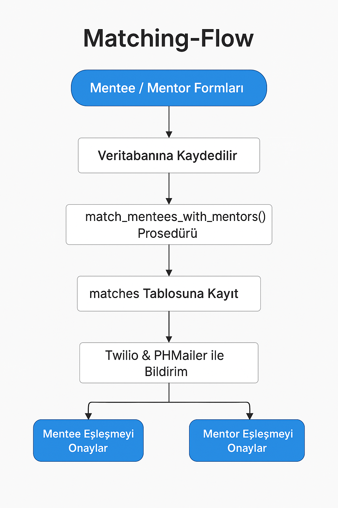
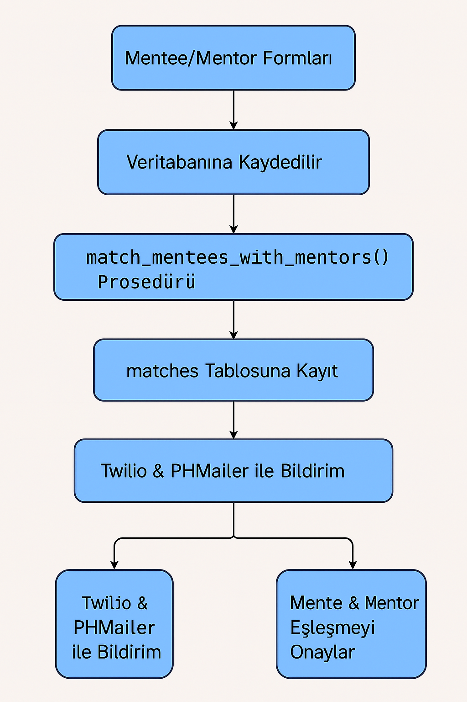
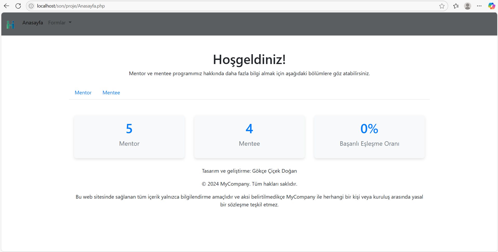
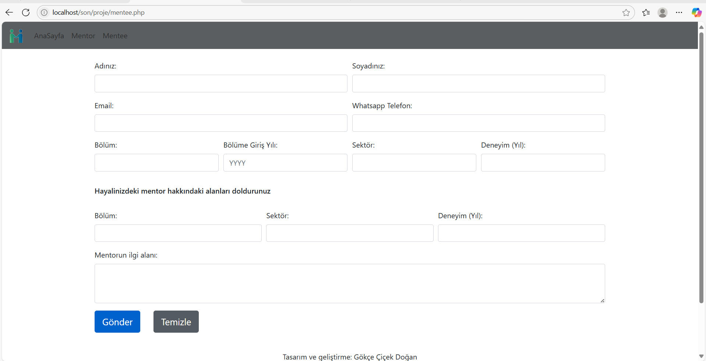
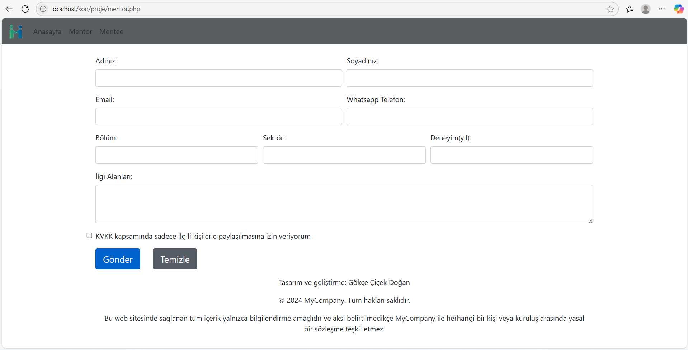
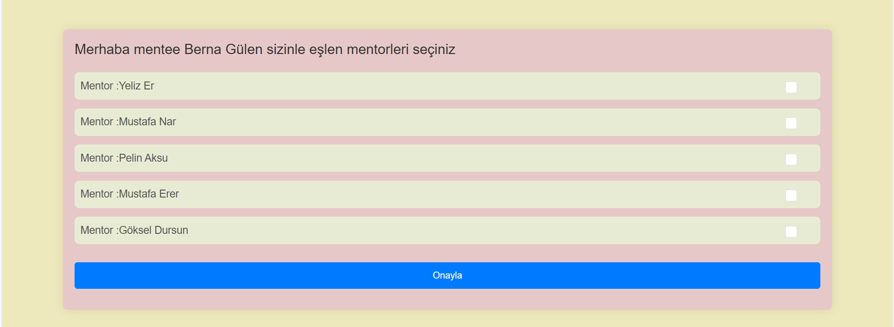
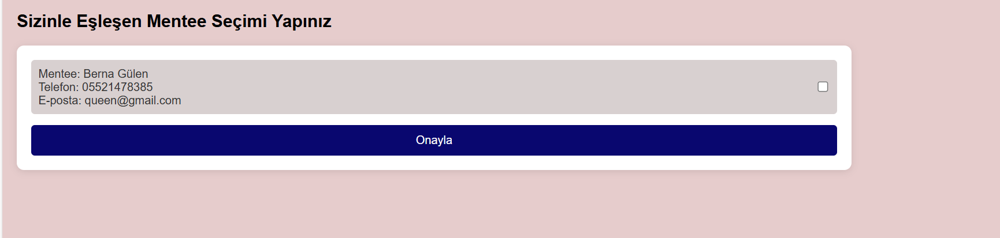

# 🌐 Mentee-Mentor Eşleştirme Sistemi | Mentee-Mentor Matching System

🔍 **Proje Hakkında | About the Project**

Bu sistem, mentee (öğrenen) ve mentor (rehber) eşleşmelerini kolaylaştırmak amacıyla PHP ve MySQL kullanılarak geliştirilmiştir. Kullanıcılar kayıt formu aracılığıyla sisteme dahil olur, KVKK onayıyla verileri işlenir ve eşleştirme algoritması ile en uygun partnerler önerilir. Son aşamada Twilio ve PHPMailer ile bildirim gönderimi yapılır ve çift taraflı onay ile eşleşme tamamlanır.

This system is built to streamline the matching between mentees and mentors using PHP and MySQL. Users join via registration forms with KVKK-compliant data handling. Matching is performed via a stored procedure, and WhatsApp/email notifications support mutual confirmation.

---

## 🛠️ Kullanılan Teknolojiler | Technologies Used

- PHP (Procedural & Stored Procedures)
- MySQL (Relational DB Design & Cursors)
- Twilio API (WhatsApp Messaging)
- PHPMailer (Email Notifications)
- Composer & .env Configuration
- Bootstrap 5 & Custom Styling
- KVKK Compliance Principles

---

## ✨ Özellikler | Key Features

- 🧾 Kayıt formları (mentee & mentor)
- 📬 Twilio ve PHPMailer ile bildirim gönderimi
- 🔁 Stored procedure ile eşleştirme algoritması
- ✅ Seçim ekranları ve eşleşme onayı işlemleri
- 🔐 KVKK uyumlu veri paylaşımı
- 🗃️ Güçlü veritabanı ilişkileri
- 📸 Görsel arayüz ekranları

---
## 🧠 Teknik Süreç Diyagramı | Matching Flow Diagram

📷 

🔄 Süreç:
- Kayıt formları doldurulur
- Veritabanına bilgiler kaydedilir
- `match_mentees_with_mentors()` prosedürü çalışır
- Uygun mentorlar mentee’ye sunulur
- Mentee seçim yapar → mentor onay verir
- WhatsApp & e-posta ile bilgilendirme yapılır

This visual illustrates how mentees and mentors move through registration, matching, and confirmation stages, powered by stored procedure logic and external messaging tools.

---

## 🗂️ Veritabanı ER Diyagramı | Entity Relationship Diagram

📷 

🗃️ Tablolar ve ilişkileri:
- `mentee` ←→ `matches` ←→ `mentor`
- `mentee_selected_mentors`: mentee'nin seçtiği mentorlar
- `mentor_approved_mentees`: mentorun onayladığı mentee'ler

This diagram highlights the primary tables and their relationships for match tracking, candidate selection, and approval management.

---

## 🏠 Ana Sayfa | Homepage

TR: Sistemi tanıtan ana giriş ekranı. Sekmeli navigasyon, kullanıcı karşılaması, kayıt yönlendirmeleri ve istatistiksel özet kartları yer alır. EN: Main landing screen introducing the system. Tab navigation, user onboarding, form links, and summary statistics are displayed.

##  Mentee Kayıt Formu | Mentee Registration Form

TR: Mentee kayıt formu; ad-soyad, iletişim bilgileri, akademik geçmiş, mentor beklentileri ve KVKK onayı alanlarını içerir. EN: Mentee registration form including name, contact info, academic background, mentor expectations, and KVKK consent checkbox.

## Mentor Kayıt Formu | Mentor Registration Form

TR: Mentor kayıt formu; kişisel bilgiler, mesleki geçmiş, ilgi alanları ve KVKK onayı ile birlikte sunulur. EN: Mentor registration form with personal details, professional background, interest areas, and KVKK approval.

## Mentor Seçim Ekranı | Mentor Selection Screen

TR: Mentee’nin kendisine önerilen mentorları seçtiği ekran; checkbox ile seçim yapılır, “Onayla” butonu ile işlem tamamlanır. EN: Screen where mentee selects suggested mentors using checkboxes and confirms via a submit button.

## ✅ Mentee Onay Ekranı | Mentee Confirmation Screen

TR: Mentorun eşleşen mentee’yi onayladığı ekran; mentee bilgileri (ad, telefon, e-posta) gösterilir ve seçim yapılır. EN: Mentor confirmation screen showing matched mentee’s details and allowing selection via checkbox.

---

## 🔐 KVKK Uyumu | Data Privacy & Protection

- 🔒 Her kullanıcıdan açık veri paylaşım onayı alınır
- 🧭 Kişisel veriler sadece eşleşen kullanıcıyla paylaşılır
- 📜 Formlarda KVKK kutusu açıkça belirtilmiştir

Every user explicitly consents to data sharing. Personal information is only visible to matched users. KVKK standards are fully respected across the system.

---

## 👩‍💻 Geliştirici Bilgileri | Developer Info

**Gökçe Çiçek Doğan**  
🔧 Backend Developer — PHP & MySQL  
🎯 Etik tasarıma ve kullanıcı güvenliğine odaklı çözüm üreticisi  
🌐 Twilio & PHPMailer ile iletişim entegrasyonu uzmanı

---

## 📄 Lisans | License

Bu proje yalnızca demo ve eğitim amaçlı kullanılabilir. Ticari kullanımlar geliştirici onayı gerektirir.

This project is for educational/demo use only. Commercial applications require explicit permission from the developer.
